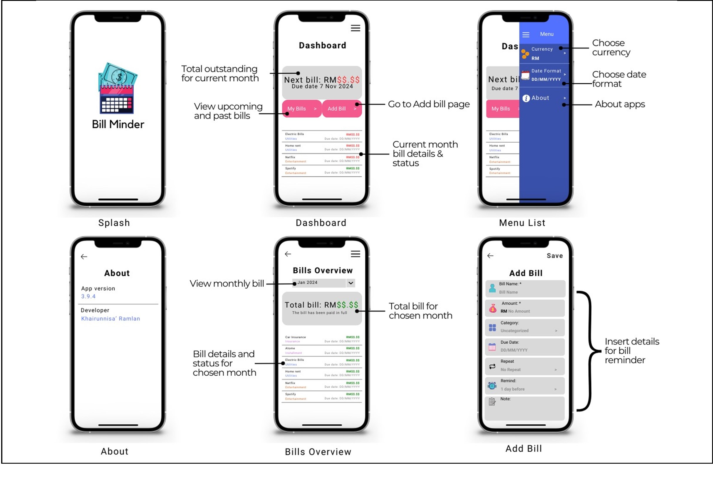

# 📱 BillMinderApp

BillMinderApp is a <b>mobile application</b> designed to help users track upcoming bills and avoid missed payments. The app provides a simple dashboard, bill reminders, and clear bill details to support better personal finance management.

---

## 🖼️ App Interface

  

---

## ✨ Features

* 📊 **Bill Overview** – View simple dashboard shows total amount bills for that month. System should provide list of all upcoming and past bills
* ⏰ **Auto Bill Reminder** – Setup reminder for monthly bills or subscriptions (e.g., Netflix, Icloud, Atome) with option to choose either fixed period or indefinite duration. 
* 🧾 **Bill Tracking & Categorization** – Add and classify types of bills (e.g., rent, utilities, subscriptions) for simple management
* 🗂️ **Color-coded Bill Status** – Apply color-coding to indicate the status of each bills as visual aid to user.
* 📱 **User-Friendly UI** – Clean and simple mobile interface

---

## 🛠️ Tech Stack

* **Framework:** .NET MAUI / Xamarin.Forms
* **Language:** C#
* **UI:** XAML
* **Platform:** Android

---

## 🚀 Getting Started

### Prerequisites

* Visual Studio 2022 or later
* .NET MAUI / Xamarin workload installed
* Android Emulator or physical device

---

## 🎯 Project Objective

1. Help students organize their future bills by providing reminders and organizational tools.
2. Notify timely reminders before due dates to avoid missing payments.
3. Provide students with a straightforward interface to track and handle ongoing bills without requiring complex systems.
4. Promote financial discipline by recording previous and future bills.
---

## 📌 Future Enhancements

* 🔔 Push notification reminders
* 📆 Calendar view for bills
* ☁️ Cloud backup & sync
* 🔐 User authentication

---

## 👩‍💻 Author

**Khairunnisa' Ramlan**  
Bachelor of Computer Science (Software Engineering) (Hons.) 
Universiti Tenaga Nasional, Kajang 
<a href="https://www.linkedin.com/in/nisa-ramlan-1203502ba/">🔗 LinkedIn</a>

---

## 📄 This project is for **academic and learning purposes**.
